# Website map examples

Fourteen examples from the current 457-map collection, including the updated Newcastle city and university maps. Every image comes from its final plotting artwork.

Use the WebP files in [images/](images/) for the website. The [example manifest](manifest.json) includes titles, dimensions, direct image URLs, hashes and links to the corresponding plotting files. Copy the images into the website's public asset directory and use those local paths. These small WebPs are stored directly in Git and can also be downloaded individually without Git LFS.

The [complete collection](../artwork/production-maps-2026-09-06/) has all 457 masters, previews and plot jobs. For its large files, clone with Git LFS and run `git lfs pull`. Use the master SVGs for plotting. Keep the [accompanying credits](../artwork/production-maps-2026-09-06/ATTRIBUTION.md) and each map's source terms with the relevant website listing.

### Newcastle — city

<a href="../artwork/production-maps-2026-09-06/08-city-maps-uk/newcastle-city-a3-portrait/newcastle-city-a3-portrait.png">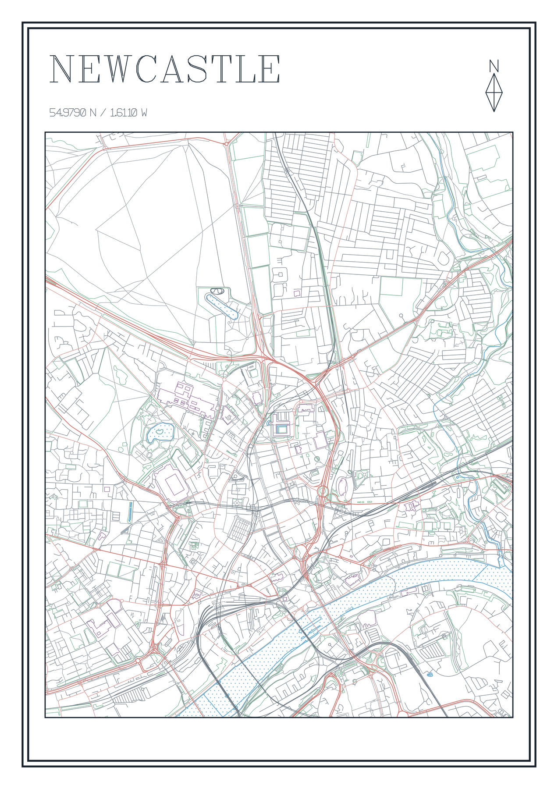</a>

[Website image](images/newcastle-city.webp) · [Full PNG](../artwork/production-maps-2026-09-06/08-city-maps-uk/newcastle-city-a3-portrait/newcastle-city-a3-portrait.png) · [Plotting SVG](../artwork/production-maps-2026-09-06/08-city-maps-uk/newcastle-city-a3-portrait/newcastle-city-a3-portrait.svg)

### Newcastle — university

<a href="../artwork/production-maps-2026-09-06/01-university-cities-uk/newcastle-university-a3-portrait/newcastle-university-a3-portrait.png">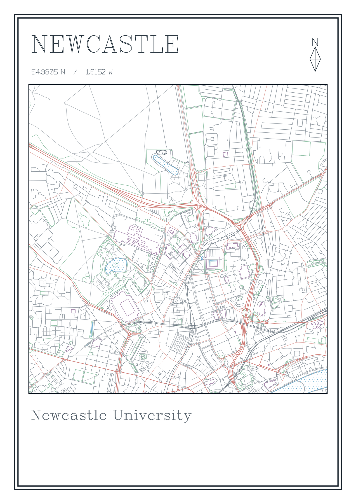</a>

[Website image](images/newcastle-university.webp) · [Full PNG](../artwork/production-maps-2026-09-06/01-university-cities-uk/newcastle-university-a3-portrait/newcastle-university-a3-portrait.png) · [Plotting SVG](../artwork/production-maps-2026-09-06/01-university-cities-uk/newcastle-university-a3-portrait/newcastle-university-a3-portrait.svg)

### Cambridge — city

<a href="../artwork/production-maps-2026-09-06/08-city-maps-uk/004-uk-university-cambridge/004-uk-university-cambridge.png">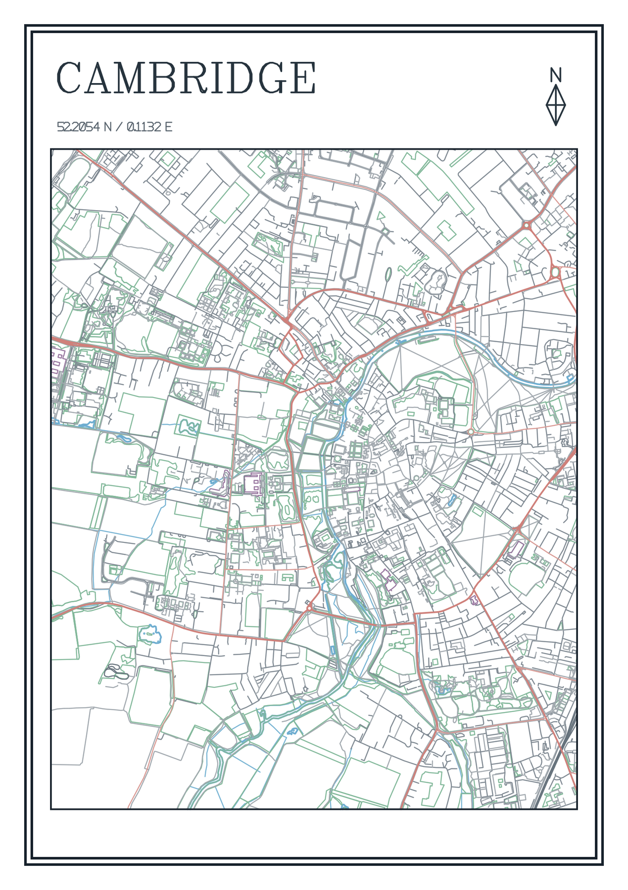</a>

[Website image](images/cambridge-city.webp) · [Full PNG](../artwork/production-maps-2026-09-06/08-city-maps-uk/004-uk-university-cambridge/004-uk-university-cambridge.png) · [Plotting SVG](../artwork/production-maps-2026-09-06/08-city-maps-uk/004-uk-university-cambridge/004-uk-university-cambridge.svg)

### Edinburgh — city

<a href="../artwork/production-maps-2026-09-06/08-city-maps-uk/025-uk-university-edinburgh/025-uk-university-edinburgh.png">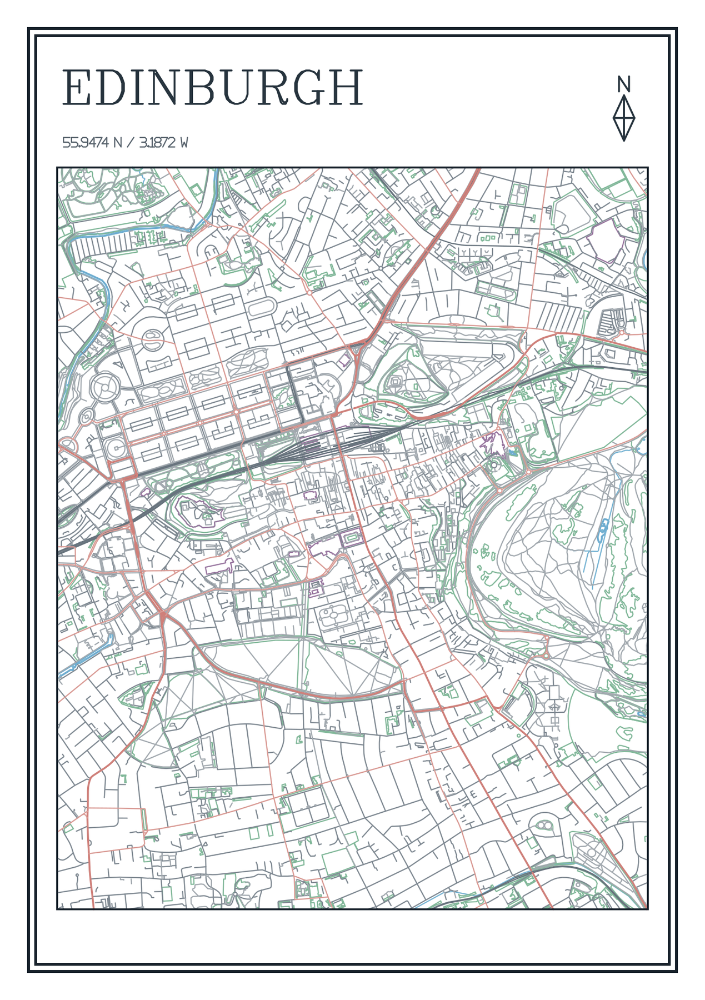</a>

[Website image](images/edinburgh-city.webp) · [Full PNG](../artwork/production-maps-2026-09-06/08-city-maps-uk/025-uk-university-edinburgh/025-uk-university-edinburgh.png) · [Plotting SVG](../artwork/production-maps-2026-09-06/08-city-maps-uk/025-uk-university-edinburgh/025-uk-university-edinburgh.svg)

### Oxford — university

<a href="../artwork/production-maps-2026-09-06/01-university-cities-uk/005-uk-university-oxford/005-uk-university-oxford.png">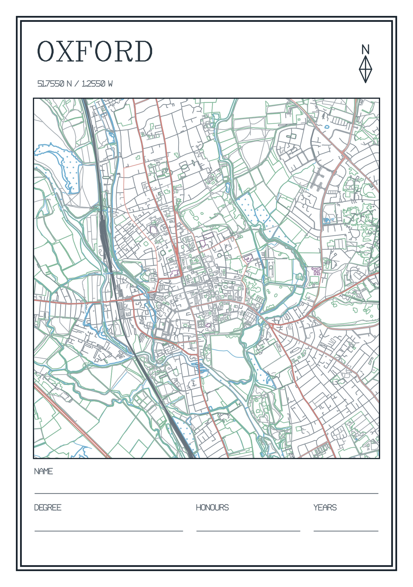</a>

[Website image](images/oxford-university.webp) · [Full PNG](../artwork/production-maps-2026-09-06/01-university-cities-uk/005-uk-university-oxford/005-uk-university-oxford.png) · [Plotting SVG](../artwork/production-maps-2026-09-06/01-university-cities-uk/005-uk-university-oxford/005-uk-university-oxford.svg)

### Stanford — university

<a href="../artwork/production-maps-2026-09-06/02-university-cities-us/002-us-university-stanford/002-us-university-stanford.png">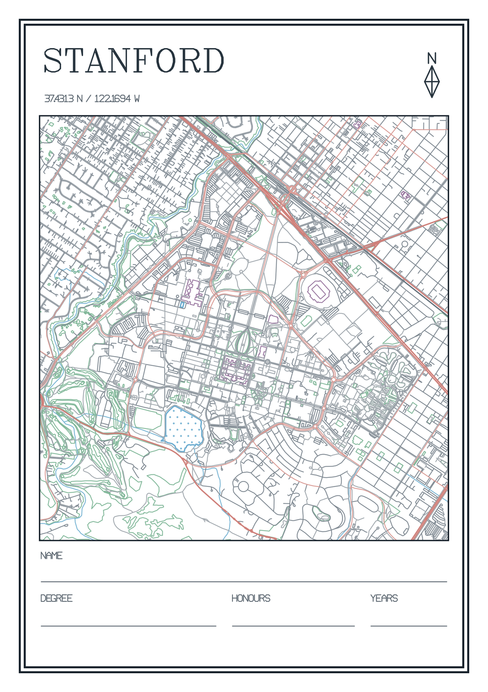</a>

[Website image](images/stanford-university.webp) · [Full PNG](../artwork/production-maps-2026-09-06/02-university-cities-us/002-us-university-stanford/002-us-university-stanford.png) · [Plotting SVG](../artwork/production-maps-2026-09-06/02-university-cities-us/002-us-university-stanford/002-us-university-stanford.svg)

### West Highland Way

<a href="../artwork/production-maps-2026-09-06/03-hiking-maps/RTE-GB-WHW-01--terrain-relief/RTE-GB-WHW-01--terrain-relief.png">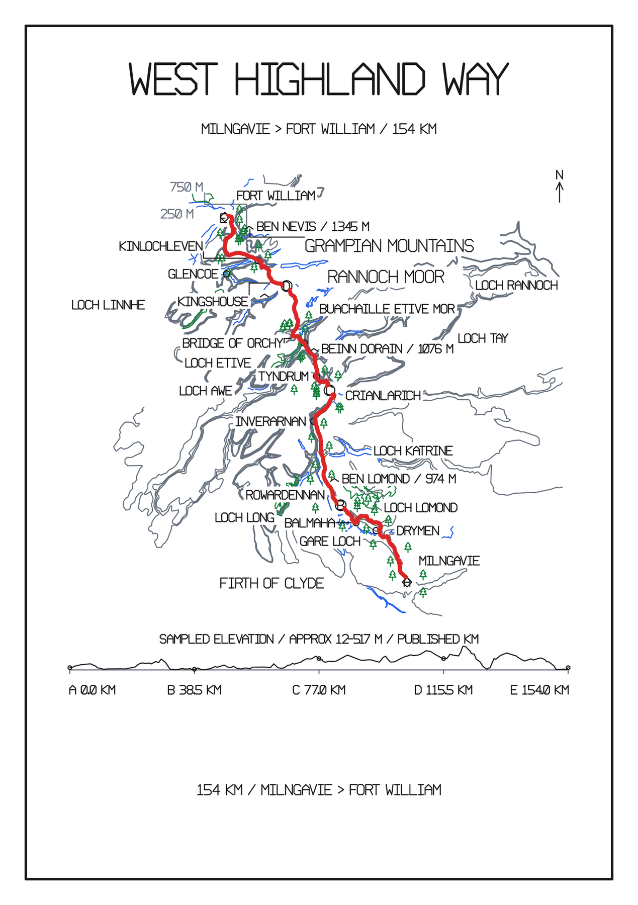</a>

[Website image](images/west-highland-way.webp) · [Full PNG](../artwork/production-maps-2026-09-06/03-hiking-maps/RTE-GB-WHW-01--terrain-relief/RTE-GB-WHW-01--terrain-relief.png) · [Plotting SVG](../artwork/production-maps-2026-09-06/03-hiking-maps/RTE-GB-WHW-01--terrain-relief/RTE-GB-WHW-01--terrain-relief.svg)

### Seaton Sluice and Holywell Dene

<a href="../artwork/production-maps-2026-09-06/03-hiking-maps/seaton-sluice-holywell-dene-a3-landscape/seaton-sluice-holywell-dene-a3-landscape.png">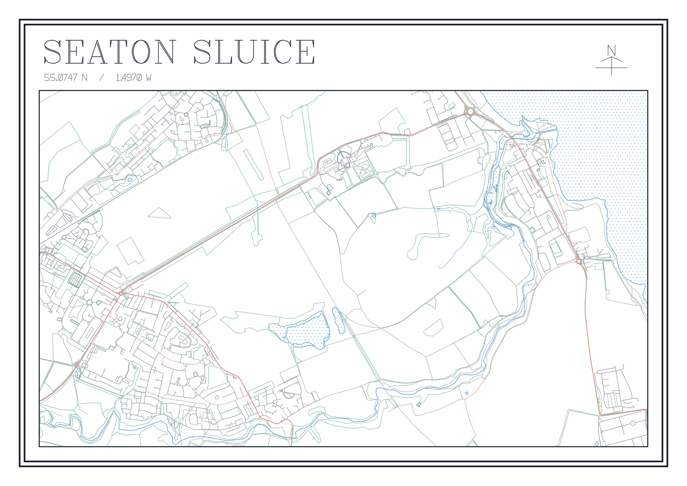</a>

[Website image](images/seaton-sluice.webp) · [Full PNG](../artwork/production-maps-2026-09-06/03-hiking-maps/seaton-sluice-holywell-dene-a3-landscape/seaton-sluice-holywell-dene-a3-landscape.png) · [Plotting SVG](../artwork/production-maps-2026-09-06/03-hiking-maps/seaton-sluice-holywell-dene-a3-landscape/seaton-sluice-holywell-dene-a3-landscape.svg)

### London Marathon

<a href="../artwork/production-maps-2026-09-06/04-marathon-courses/001-london-marathon-2026/001-london-marathon-2026.png">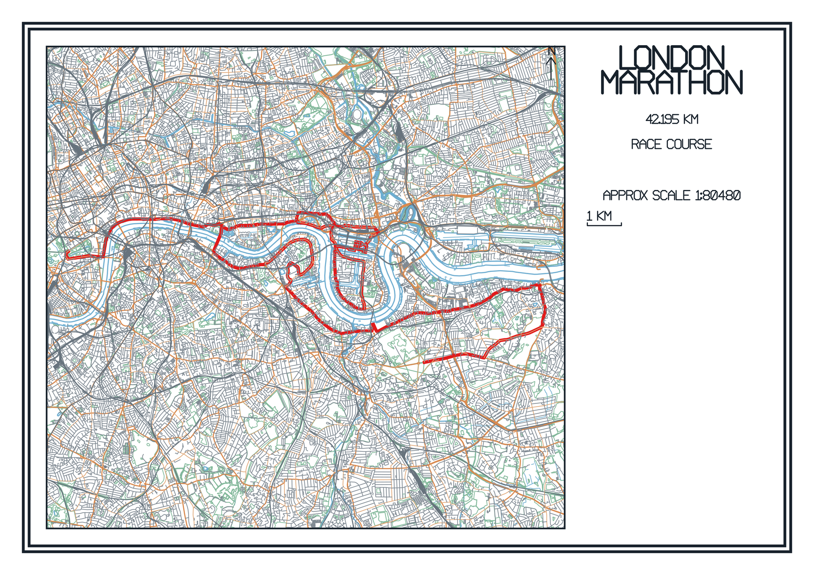</a>

[Website image](images/london-marathon.webp) · [Full PNG](../artwork/production-maps-2026-09-06/04-marathon-courses/001-london-marathon-2026/001-london-marathon-2026.png) · [Plotting SVG](../artwork/production-maps-2026-09-06/04-marathon-courses/001-london-marathon-2026/001-london-marathon-2026.svg)

### Henley Royal Regatta

<a href="../artwork/production-maps-2026-09-06/05-rowing-races/henley-royal--a3-portrait/henley-royal.png">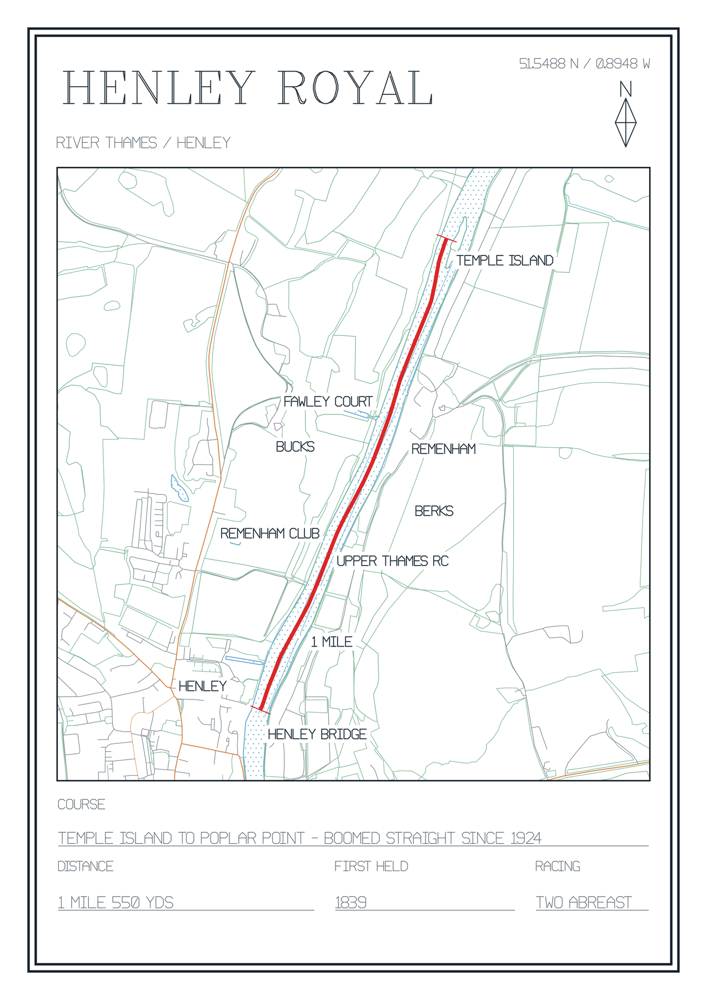</a>

[Website image](images/henley-royal-regatta.webp) · [Full PNG](../artwork/production-maps-2026-09-06/05-rowing-races/henley-royal--a3-portrait/henley-royal.png) · [Plotting SVG](../artwork/production-maps-2026-09-06/05-rowing-races/henley-royal--a3-portrait/henley-royal.svg)

### Monaco

<a href="../artwork/production-maps-2026-09-06/06-f1-courses/monaco-2026--circuit-atlas-v2-a3-portrait/monaco-2026--circuit-atlas-v2-a3-portrait.png">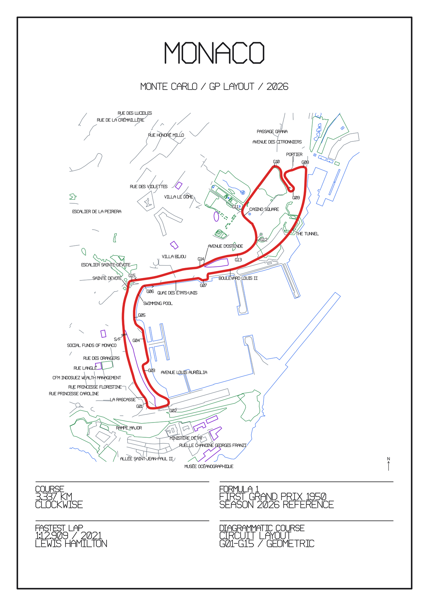</a>

[Website image](images/monaco.webp) · [Full PNG](../artwork/production-maps-2026-09-06/06-f1-courses/monaco-2026--circuit-atlas-v2-a3-portrait/monaco-2026--circuit-atlas-v2-a3-portrait.png) · [Plotting SVG](../artwork/production-maps-2026-09-06/06-f1-courses/monaco-2026--circuit-atlas-v2-a3-portrait/monaco-2026--circuit-atlas-v2-a3-portrait.svg)

### Silverstone

<a href="../artwork/production-maps-2026-09-06/06-f1-courses/great-britain-silverstone-2026--circuit-atlas-v2-a3-landscape/great-britain-silverstone-2026--circuit-atlas-v2-a3-landscape.png">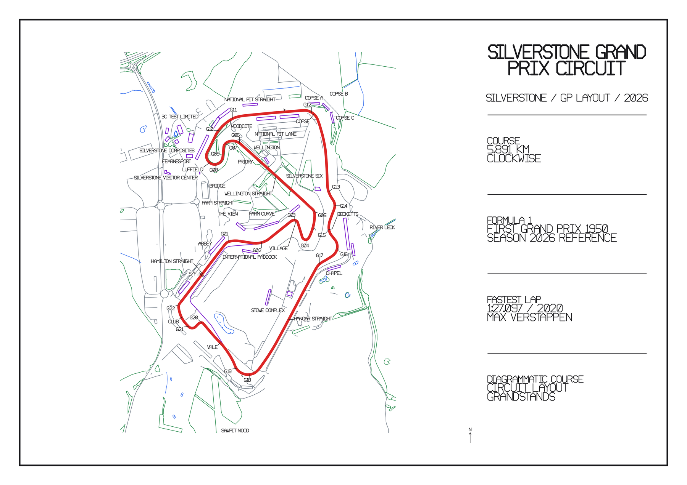</a>

[Website image](images/silverstone.webp) · [Full PNG](../artwork/production-maps-2026-09-06/06-f1-courses/great-britain-silverstone-2026--circuit-atlas-v2-a3-landscape/great-britain-silverstone-2026--circuit-atlas-v2-a3-landscape.png) · [Plotting SVG](../artwork/production-maps-2026-09-06/06-f1-courses/great-britain-silverstone-2026--circuit-atlas-v2-a3-landscape/great-britain-silverstone-2026--circuit-atlas-v2-a3-landscape.svg)

### St Andrews — The Old Course

<a href="../artwork/production-maps-2026-09-06/07-golf-courses/old-course-st-andrews/old-course-st-andrews.png">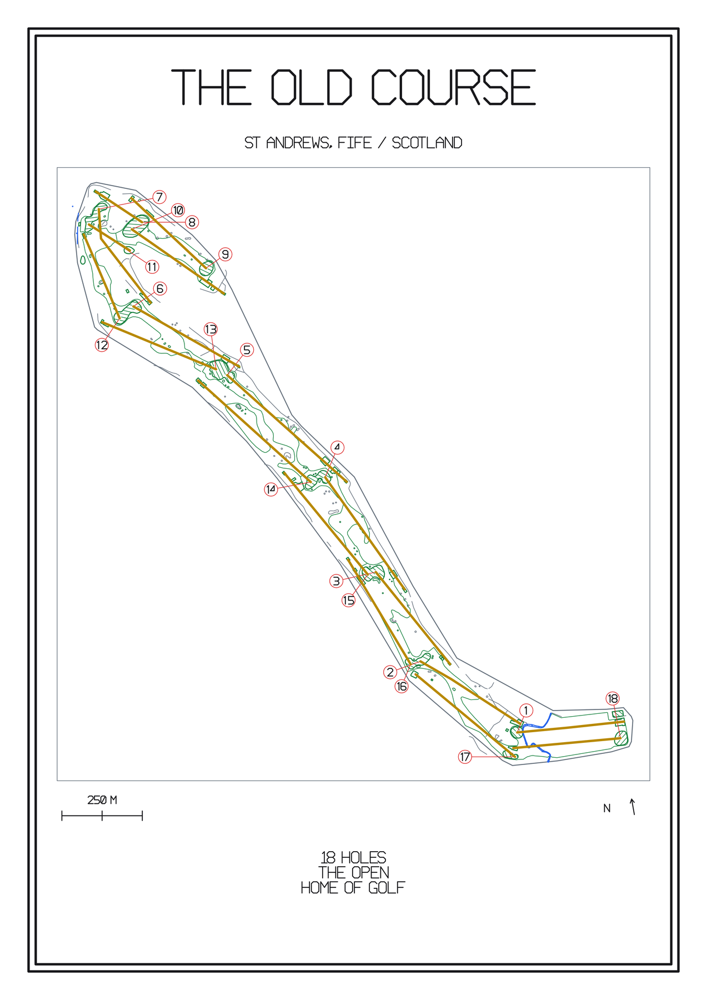</a>

[Website image](images/st-andrews-old-course.webp) · [Full PNG](../artwork/production-maps-2026-09-06/07-golf-courses/old-course-st-andrews/old-course-st-andrews.png) · [Plotting SVG](../artwork/production-maps-2026-09-06/07-golf-courses/old-course-st-andrews/old-course-st-andrews.svg)

### Augusta National

<a href="../artwork/production-maps-2026-09-06/07-golf-courses/augusta-national/augusta-national.png">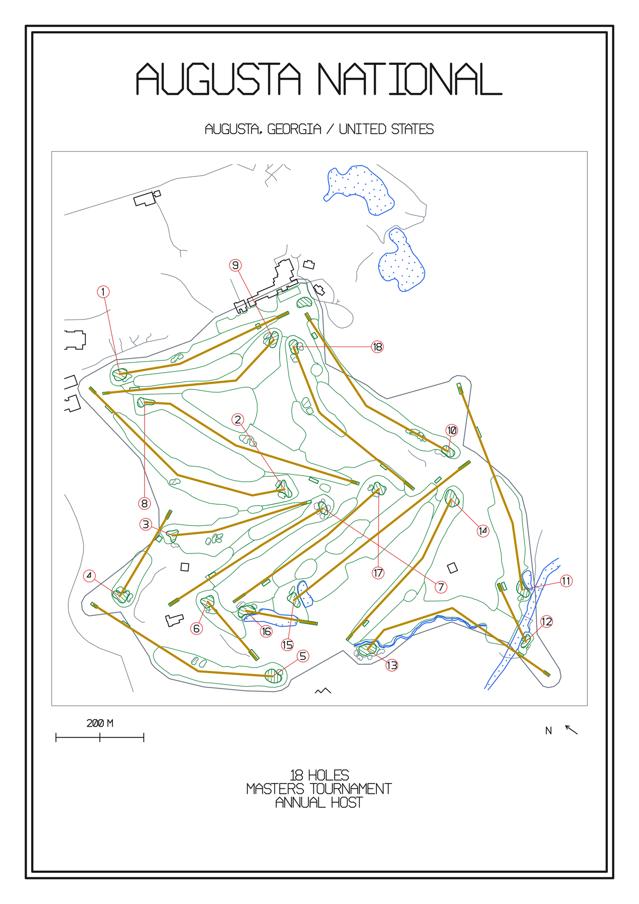</a>

[Website image](images/augusta-national.webp) · [Full PNG](../artwork/production-maps-2026-09-06/07-golf-courses/augusta-national/augusta-national.png) · [Plotting SVG](../artwork/production-maps-2026-09-06/07-golf-courses/augusta-national/augusta-national.svg)

Rebuild these previews with `python scripts/build_website_examples.py` in an environment with Pillow installed.
